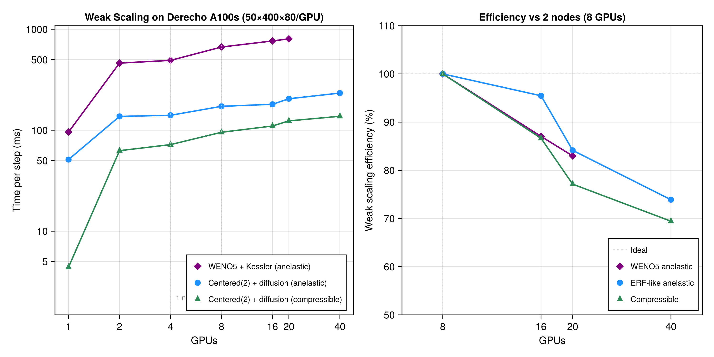

# BreezeAnelasticBenchmarks

Weak-scaling GPU benchmarks for atmospheric supercell simulations
built with [Breeze.jl](https://github.com/NumericalEarth/Breeze.jl)
and [Oceananigans.jl](https://github.com/CliMA/Oceananigans.jl)
on [NCAR Derecho](https://ncar-hpc-docs.readthedocs.io/en/latest/compute-systems/derecho/)
(NVIDIA A100-SXM4-40GB GPUs, 4 per node, NVLink intra-node, Slingshot-11 inter-node).



## Benchmark configurations

Three test cases are benchmarked, all using the DCMIP2016 supercell initial conditions
with Kessler microphysics, Tetens saturation vapor pressure, and SSP-RK3 time stepping.
Weak scaling extends the domain in x via `Partition(Ngpus, 1)`.

| Config | Dynamics | Advection | Closure | Halo | Pressure solve |
|--------|----------|-----------|---------|------|----------------|
| **WENO5 supercell** | `AnelasticDynamics` | `WENO(order=5)` | — | (5,5,5) | Distributed FFT + tridiagonal |
| **ERF-like anelastic** | `AnelasticDynamics` | `Centered(order=2)` | `ScalarDiffusivity(ν=200, κ=200)` | (1,1,1) | Distributed FFT + tridiagonal |
| **ERF-like compressible** | `CompressibleDynamics` | `Centered(order=2)` | `ScalarDiffusivity(ν=200, κ=200)` | (1,1,1) | None (diagnostic EOS) |

Two per-GPU grid sizes are tested:
- **400×400×80** per GPU (168 km × 168 km × 20 km) — the full supercell grid
- **50×400×80** per GPU — matching the ERF comparison where 400×400×80 is split across 8 GPUs (2 nodes)

Timing uses 100 time steps at dt = 0.1 s, three trials (first is warmup).

## Results

### Single GPU (NT=100, Derecho A100-SXM4-40GB)

| Config | Float32 (ms/step) | Float64 (ms/step) | F64/F32 |
|--------|-------------------|-------------------|---------|
| WENO5 + Kessler, anelastic (400×400×80) | 95.4 | 148.5 | 1.56x |
| Centered(2) + diffusion, anelastic (50×400×80) | 53.7 | 64.9 | 1.21x |
| Centered(2) + diffusion, compressible (50×400×80) | 5.2 | 5.4 | 1.04x |

### Weak scaling (Float32, x-only partition, NT=100, all optimizations applied)

**50×400×80 per GPU:**

| GPUs | Nodes | WENO5 anelastic | ERF anelastic | Compressible |
|------|-------|----------------|--------------|-------------|
| 1    | 1     | 95.4 ms/step   | 51.2 ms/step | 4.4 ms/step |
| 2    | 1     | 462.2          | 137.0        | 62.7        |
| 4    | 1     | 491.6          | 140.5        | 72.0        |
| 8    | 2     | 666.6          | 172.4        | 95.4        |
| 16   | 4     | 765.9          | 180.6        | 110.1       |
| 20   | 5     | 803.3          | 204.9        | 123.7       |
| 40   | 10    | —              | 233.3        | 137.4       |

Note: WENO5 uses 400×400×80/GPU in this table (different per-GPU size than ERF/compressible).

**400×400×80 per GPU** (ERF anelastic + compressible): results pending.

### Multi-node scaling efficiency (relative to 2 nodes / 8 GPUs)

| GPUs | Nodes | WENO5 | ERF anelastic | Compressible |
|------|-------|-------|--------------|-------------|
| 8    | 2     | 100%  | 100%         | 100%        |
| 16   | 4     | 87%   | 96%          | 87%         |
| 20   | 5     | 83%   | 84%          | 77%         |
| 40   | 10    | —     | 74%          | 69%         |

## Package structure

This repo is a Julia package (`BreezeAnelasticBenchmarks`) that exports
`setup_supercell`, `setup_supercell_erf`, `setup_supercell_compressible`,
and `run_benchmark!`.

| Path | Description |
|------|-------------|
| `src/BreezeAnelasticBenchmarks.jl` | Package module with setup functions and precompile workloads |
| `benchmarks/distributed_supercell_benchmark.jl` | WENO5 anelastic weak-scaling script |
| `benchmarks/distributed_supercell_erf_benchmark.jl` | ERF-like anelastic weak-scaling script |
| `benchmarks/distributed_supercell_compressible_benchmark.jl` | Compressible weak-scaling script |
| `benchmarks/benchmark_pressure_solver.jl` | Isolated pressure solver benchmark |
| `benchmarks/benchmark_transpose_strategies.jl` | MPI transpose strategy comparison |
| `plot_scaling.jl` | CairoMakie scaling plot script |

## Running on Derecho (NCAR)

### Setup

```bash
module --force purge
module load ncarenv nvhpc cuda cray-mpich
julia +1.12 --project=. -e 'using Pkg; Pkg.instantiate()'
julia +1.12 --project=. -e 'using MPIPreferences; MPIPreferences.use_system_binary(vendor="cray")'
julia +1.12 --project=. -e 'using Pkg; Pkg.precompile()'
```

### Weak scaling

All scripts support `NT`, `NX_PER_GPU`, `NY_PER_GPU`, `PARTITION_X_ONLY`, `RX`, `RY`,
and `FLOAT_TYPE` environment variables via `-v` on `qsub`.

```bash
# WENO5 anelastic, 4 GPUs, 100 steps
qsub -v NGPUS=4,NT=100 -l select=1:ncpus=64:mpiprocs=4:ngpus=4:gpu_type=a100:mem=384GB \
    benchmarks/derecho_distributed_supercell_benchmark.sh

# ERF anelastic, 8 GPUs, x-only, 50×400×80/GPU
qsub -v NGPUS=8,PARTITION_X_ONLY=1,NX_PER_GPU=50,NY_PER_GPU=400,NT=100 \
    -l select=2:ncpus=64:mpiprocs=4:ngpus=4:gpu_type=a100:mem=384GB \
    benchmarks/derecho_distributed_supercell_erf_benchmark.sh

# Compressible, 8 GPUs, 50×400×80/GPU
qsub -v NX_PER_GPU=50,NY_PER_GPU=400,NT=100 \
    -l select=2:ncpus=64:mpiprocs=4:ngpus=4:gpu_type=a100:mem=384GB \
    benchmarks/derecho_distributed_supercell_compressible_benchmark.sh
```

Derecho has 4 A100 GPUs per node. Multi-GPU requires `JULIA_CUDA_MEMORY_POOL=none`.

## Running on Perlmutter (NERSC)

```bash
module load julia/1.12.1
sbatch benchmarks/supercell_benchmark.sh                    # single GPU
NGPUS=4 sbatch --nodes=1 benchmarks/distributed_supercell_benchmark.sh  # 4 GPUs
```

## Dependencies

Breeze is pinned to the
[`glw/distributed-tests`](https://github.com/NumericalEarth/Breeze.jl/tree/glw/distributed-tests)
branch, which includes fixes for distributed anelastic simulations and redundant halo fill removal.

Oceananigans optimizations are on the
[`glw/optimize-distributed-solver`](https://github.com/CliMA/Oceananigans.jl/tree/glw/optimize-distributed-solver)
branch (applied locally to `~/.julia/packages/Oceananigans/` on Derecho).

## Optimizations

Four optimizations were developed during this benchmarking effort:

1. **Skip `fill_corners!` when no corner neighbors exist** — eliminates unnecessary
   `CUDA.synchronize()` calls. 1-GPU distributed overhead: 2.95x → 1.19x.

2. **Solve tridiagonal in x-local space for slab-x** — reduces MPI transposes
   from 4 to 2 per pressure solve. 2.1x solver speedup.

3. **Use `Alltoall` instead of `Alltoallv`** — Cray MPICH's `Alltoallv` is 28x slower
   than `Alltoall` for GPU buffers. Transpose round-trip: 52 ms → 1.85 ms on 2 GPUs.

4. **Remove redundant halo fills in Breeze** — 3 fewer fills per RK3 stage.

Combined pressure solver improvement: **3.6x on 2 GPUs** (129.5 → 36.2 ms/solve).

See [`perlmutter_vs_derecho.md`](perlmutter_vs_derecho.md) and
[`scaling_plan.md`](scaling_plan.md) for detailed investigation notes.

## References

- [Silvestri, Wagner, et al. (2023)](https://arxiv.org/abs/2309.06662) --
  Oceananigans.jl: A library that achieves breakthrough resolution, memory
  and energy efficiency in global ocean simulations
- [Wagner et al. (2025)](https://arxiv.org/abs/2601.10441) --
  Performance benchmarks for atmospheric simulations with Breeze.jl
